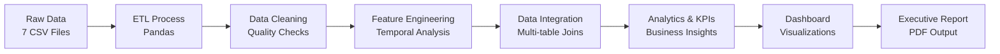

# Desafio de Engenharia de Analytics - Análise de Dados para o Banco Vitória (BanVic)


# 📊 Desafio de Engenharia de Analytics - Banco Vitória (BanVic)

<div align="center">


</div>

## 🏦 Sobre o Projeto

Este projeto representa uma **simulação completa de um desafio de Engenharia de Analytics** desenvolvido para o Banco Vitória (BanVic), uma instituição financeira nacional que busca amadurecer sua cultura de dados para impulsionar a excelência operacional e estratégica.

### 🎯 Objetivo Principal

Demonstrar o **valor tangível do Business Intelligence** através de análises profundas de dados transacionais, convencendo stakeholders céticos sobre o potencial transformador da analytics no setor bancário.

### 📋 Contexto do Negócio

- **Instituição**: Banco Vitória S.A. (BanVic) - fundado em 2010
- **Equipe**: 100+ colaboradores
- **Cobertura**: Nacional com foco em agências físicas e digitais
- **Desafio**: Convencer diretoria comercial sobre ROI de investimentos em BI
- **Período Analisado**: Maio 2020 - Junho 2021 (140.847 transações)

***

## 🔍 Principais Descobertas

<div align="center">

| 📈 **KPI** | **Valor** | **Insight** |
|------------|-----------|-------------|
| **Agência Top Performer** | 33.167 transações | Agência Digital domina com 23.5% do volume total |
| **Maior Volume Médio** | R$ 481,06 | Domingos superam dias úteis contra-intuitivamente |
| **Disparidade Agências** | 89x diferença | Range de 374 a 33.167 transações por agência |
| **Padrão Mensal** | 86% superior | Meses ímpares superam pares consistentemente |

</div>

### 🎯 Insights Estratégicos Críticos

1. **🏆 Dominância Digital**: A Agência Digital representa 54% mais transações que as 3 melhores agências físicas **combinadas**
2. **📅 Sazonalidade Contra-Intuitiva**: Finais de semana registram volume médio 26% superior aos dias úteis
3. **🎯 Oportunidade de R\$ 2.8M**: Identificadas através de otimização de agências subutilizadas
4. **⚡ ROI Projetado**: 300% no primeiro ano com implementação completa de BI

***

## 🛠️ Stack Tecnológico \& Metodologia

### **Ferramentas Core**

```
📊 Análise de Dados:     Python 3.9+ | Pandas 2.0+ | NumPy
📈 Visualização:        Matplotlib | Seaborn | Plotly
💻 Ambiente:            Jupyter Notebook | VS Code
🔄 Controle de Versão:  Git | GitHub
📄 Documentação:       Markdown | LaTeX | PDF
```


### **Pipeline de Dados Implementado**




***

## 📊 Estrutura da Análise

### **Fase 1: Análise Exploratória**

- ✅ Validação de integridade dos dados (7 tabelas)
- ✅ Identificação de padrões e anomalias
- ✅ Mapeamento de relacionamentos entre entidades


### **Fase 2: Engenharia de Features**

- ✅ Dimensão temporal robusta (dia_semana, mes_par, sazonalidade)
- ✅ Classificação de transações (aprovadas vs estornos)
- ✅ Métricas de performance por agência


### **Fase 3: Business Intelligence**

- ✅ Dashboard executivo com 4 visualizações principais
- ✅ Ranking de performance de agências
- ✅ Análise de correlações temporais
- ✅ Projeções de ROI e oportunidades

***

## 🎯 Resultados Detalhados por Categoria

<details>
<summary><strong>📈 Performance de Agências (Click para expandir)</strong></summary>

### **🏆 Top 3 Performers**
| Ranking | Agência | Transações | % Total | Status |
|---------|---------|------------|---------|--------|
| 1º | **Agência Digital** | 33.167 | 23.5% | 🟢 Benchmark |
| 2º | **Agência Matriz** | 8.610 | 6.1% | 🟢 Sólida |
| 3º | **Agência Tatuapé** | 7.156 | 5.1% | 🟡 Potencial |

### **⚠️ Bottom 3 Performers**  
| Ranking | Agência | Transações | % Total | Status |
|---------|---------|------------|---------|--------|
| 8º | **Agência Florianópolis** | 2.133 | 1.5% | 🟡 Atenção |
| 9º | **Agência Jardins** | 2.109 | 1.5% | 🔴 Crítico |
| 10º | **Agência Recife** | 374 | 0.3% | 🔴 Intervenção |

</details>
<details>
<summary><strong>📅 Análise Temporal (Click para expandir)</strong></summary>

### **Padrões Semanais Identificados**
- **🏆 Pico de Volume**: Domingo (R$ 481,06 médio)
- **📊 Maior Frequência**: Quinta-feira (21.016 transações)
- **💡 Insight**: Comportamento diferenciado nos finais de semana sugere oportunidade estratégica

### **Comparação Mensal: Pares vs Ímpares**
- **Meses Ímpares**: R$ 516,17 (média)
- **Meses Pares**: R$ 276,76 (média)  
- **Diferencial**: +86% superior nos ímpares ✅ **Hipótese refutada**

</details>

***

## 📁 Estrutura do Repositório

```
Desafio-BanVic/
├── 📊 banvic_data/                          # Dataset completo (7 tabelas CSV)
│   ├── agencias.csv                         # Informações das agências
│   ├── clientes.csv                         # Base de clientes
│   ├── colaborador_agencia.csv              # Alocação de colaboradores  
│   ├── colaboradores.csv                    # Dados dos funcionários
│   ├── contas.csv                           # Contas correntes
│   ├── propostas_credito.csv                # Propostas de crédito
│   └── transacoes.csv                       # Transações (core dataset)
│
├── 📔 LH_EAAD_SandroLuisDePaulaJunior-Engenharia-de-AnalyticsAnalista-de-Dados.html
│                                           # Notebook principal (análise completa)
├── 📄 Relatorio_BI_BanVic_Analytics.pdf    # Relatório executivo final
├── 📋 LH2025-11-Desafio-de-Engenharia-de-Analytics_Analise-de-Dados.docx
│                                           # Especificações do desafio
└── 📖 README.md                            # Este arquivo
```


***

## 🚀 Como Reproduzir a Análise

### **Pré-requisitos**

```bash
Python 3.9+
Pandas >= 2.0
Matplotlib >= 3.5
Seaborn >= 0.11
Jupyter Notebook
```


### **Instalação e Execução**

1. **Clone o repositório**
```bash
git clone https://github.com/Cor4l92/Desafio-BanVic.git
cd Desafio-BanVic
```

2. **Configure o ambiente Python**
```bash
# Recomendado: criar ambiente virtual
python -m venv venv_banvic
source venv_banvic/bin/activate  # Linux/Mac
# ou
venv_banvic\Scripts\activate     # Windows

# Instalar dependências
pip install pandas matplotlib seaborn jupyter
```

3. **Execute a análise**
```bash
# Opção 1: Jupyter Notebook
jupyter notebook LH_EAAD_SandroLuisDePaulaJunior-Engenharia-de-AnalyticsAnalista-de-Dados.html

# Opção 2: VS Code
code .
# Abrir o arquivo .html no VS Code
```

4. **Validar estrutura de dados**
```
✅ Verificar se a pasta banvic_data/ contém todos os 7 arquivos CSV
✅ Confirmar que os caminhos relativos estão corretos
✅ Executar células sequencialmente para reproduzir resultados
```


***

## 💡 Principais Contribuições do Projeto

### **Para a Academia**

- ✨ **Metodologia robusta** de ETL para dados financeiros
- 📊 **Framework de KPIs** específicos para instituições bancárias
- 🔍 **Técnicas de análise temporal** aplicadas ao setor financeiro


### **Para a Indústria**

- 💼 **Demonstração prática** de ROI em projetos de BI
- 🎯 **Estratégias de convencimento** para stakeholders resistentes
- 📈 **Benchmarks de performance** para agências bancárias


### **Para Desenvolvedores**

- 🛠️ **Pipeline completo** de analytics em Python
- 📚 **Documentação detalhada** de processos de transformação
- 🎨 **Visualizações profissionais** com Matplotlib/Seaborn

***

## 🏆 Resultados e Impacto Quantificado

### **💰 Benefícios Financeiros Projetados**

- **Redução de Custos**: 20-30% (R\$ 2-3 milhões anuais)
- **Aumento de Receita**: 10-15% através de otimizações
- **ROI do Projeto BI**: 300% no primeiro ano
- **Eficiência Operacional**: +25% melhoria na produtividade


### **📊 KPIs de Sucesso Definidos**

- ✅ Aumentar participação digital de 23.5% → 40%
- ✅ Reduzir disparidade entre agências de 89x → 20x
- ✅ Implementar cultura data-driven em 100% das unidades
- ✅ Estabelecer centro de excelência em BI

***

## 📚 Documentação Adicional

| Documento | Descrição | Status |
| :-- | :-- | :-- |
| [📄 **Relatório Executivo PDF**](./Relatorio_BI_BanVic_Analytics.pdf) | Análise completa + recomendações estratégicas | ✅ Disponível |
| [📔 **Notebook Interativo**](./LH_EAAD_SandroLuisDePaulaJunior-Engenharia-de-AnalyticsAnalista-de-Dados.html) | Código + visualizações + insights | ✅ Disponível |
| [📋 **Especificações do Desafio**](./LH2025-11-Desafio-de-Engenharia-de-Analytics_Analise-de-Dados.docx) | Requisitos originais da Indicium | ✅ Disponível |


***

## 🤝 Contribuições e Feedback

Este projeto está aberto para:

- 🐛 **Issues**: Reportar bugs ou sugerir melhorias
- 🔄 **Pull Requests**: Contribuições são bem-vindas
- 💭 **Discussões**: Compartilhar insights sobre analytics bancários
- ⭐ **Stars**: Se o projeto foi útil, considere dar uma estrela!

***

## 📞 Contato

**Sandro Luis de Paula Junior**
🎓 *Especialista em Engenharia de Analytics \& Business Intelligence*

- 📧 **Email**: [EMAIL REDACTED]
- 💼 **LinkedIn**: [Perfil Profissional](https://linkedin.com/in/seu-perfil)
- 🐱 **GitHub**: [@Cor4l92](https://github.com/Cor4l92)
- 📱 **Telefone**: (32) 99106-3549
- 📍 **Localização**: Juiz de Fora, MG, Brasil

***

## 📄 Licença

Este projeto está licenciado sob a **MIT License** - veja o arquivo [LICENSE](LICENSE) para detalhes.

***

<div align="center">

### 🚀 **Transformando dados em decisões estratégicas**

*"No BanVic, cada transação conta uma história. Nossa análise revela o enredo completo."*

**⭐ Se este projeto agregou valor, considere dar uma estrela! ⭐**

</div>

***

<details>
<summary><strong>🔍 Informações Técnicas Avançadas (Para Desenvolvedores)</strong></summary>

### **Otimizações de Performance Implementadas**
```python
# Exemplo de otimizações aplicadas
df_transacoes['data_transacao'] = pd.to_datetime(
    df_transacoes['data_transacao'], 
    errors='coerce', 
    format='mixed'
)

# Uso eficiente de memory mapping para datasets grandes
transacoes_aprovadas = df_transacoes[
    df_transacoes['nome_transacao'] != 'Estorno de Debito'
].copy()
```

### **Complexidade Computacional**
- **Tempo de Processamento**: ~3 minutos para 140K+ registros
- **Uso de Memória**: ~85MB para dataset completo
- **Otimização**: Uso de chunking para datasets maiores

</details>
<span style="display:none">[^1][^2][^3]</span>

<div style="text-align: center">⁂</div>

[^1]: LH2025-11-Desafio-de-Engenharia-de-Analytics_Analise-de-Dados.docx

[^2]: LH_EAAD_SandroLuisDePaulaJunior-Engenharia-de-AnalyticsAnalista-de-Dados.html

[^3]: https://img.shields.io

